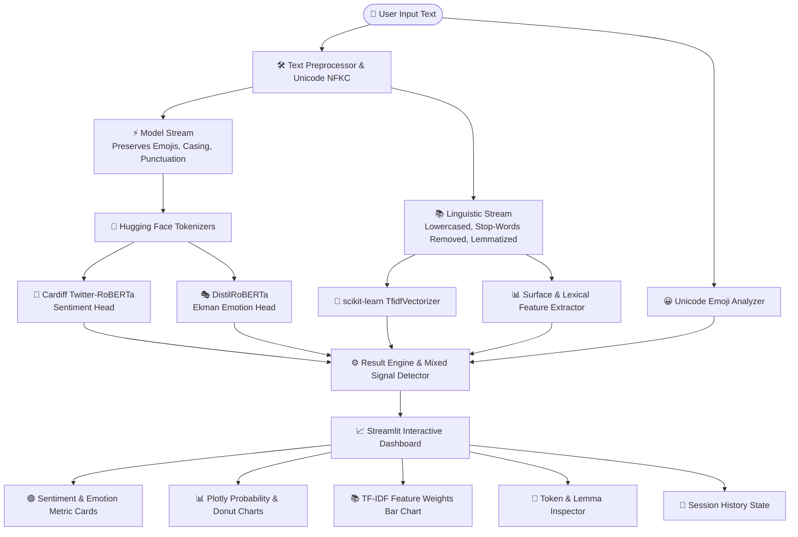

# 🧠 Intelligent Sentiment & Emotion Analyzer
### *Comprehensive Text Mining, NLP Preprocessing, TF-IDF Vectorization, Emoji Semantics & Pretrained Transformers*

[](https://streamlit.io/)
[](https://pytorch.org/)
[](https://huggingface.co/)
[](https://scikit-learn.org/)
[](https://python.org/)
[](https://opensource.org/licenses/MIT)

---

## 📑 Table of Contents
1. [Project Overview](#-1-project-overview)
2. [End-to-End System Architecture](#-2-end-to-end-system-architecture)
3. [Component-by-Component Deep Dive](#-3-component-by-component-deep-dive)
   - [3.1 Dual-Stream Preprocessing](#31-dual-stream-preprocessing)
   - [3.2 Classical Text Mining & TF-IDF](#32-classical-text-mining--tf-idf)
   - [3.3 Feature Extraction Engine](#33-feature-extraction-engine)
   - [3.4 Emoji Semantic Decomposition](#34-emoji-semantic-decomposition)
   - [3.5 Transformer Sentiment Analysis](#35-transformer-sentiment-analysis)
   - [3.6 Transformer Emotion Detection](#36-transformer-emotion-detection)
   - [3.7 Mixed & Contrastive Sentiment Engine](#37-mixed--contrastive-sentiment-engine)
4. [Theoretical Comparison: TF-IDF vs. Transformers](#-4-theoretical-comparison-tf-idf-vs-transformers)
5. [Model Registry & Specifications](#-5-model-registry--specifications)
6. [Interactive Streamlit UI Walkthrough](#-6-interactive-streamlit-ui-walkthrough)
7. [Repository Structure](#-7-repository-structure)
8. [Installation & Quickstart](#-8-installation--quickstart)
9. [Automated Test Suite](#-9-automated-test-suite)
10. [Benchmark Scenarios & Empirical Results](#-10-benchmark-scenarios--empirical-results)
11. [Project Discussion & Viva Defense Guide](#-11-project-discussion--viva-defense-guide)
12. [Deployment Guidelines](#-12-deployment-guidelines)
13. [Security & Privacy](#-13-security--privacy)

---

## 🌟 1. Project Overview

In digital communication, user-generated texts (customer reviews, tweets, support tickets, forum posts) contain nuanced sentiment, multi-class emotions, slang, hashtags, and emojis. Traditional lexicon or shallow bag-of-words classifiers fail to capture contextual semantics and non-verbal emoji cues.

This project delivers a **production-grade, academically rigorous analytical system** combining:
- **Classical Text Mining & Feature Engineering:** Unicode normalization, tokenization, stop-word removal, WordNet lemmatization, surface metrics, and **TF-IDF numerical vectorization**.
- **Deep Contextual Transformers:** **Twitter-RoBERTa** (3-class Sentiment: Positive, Neutral, Negative) and **DistilRoBERTa** (7-class Ekman taxonomy: Joy, Sadness, Anger, Fear, Surprise, Disgust, Neutral).
- **Emoji Semantics Engine:** Full extraction, counting, and polarity mapping of Unicode emojis.
- **Interactive Visual Dashboard:** Built entirely in Python using **Streamlit** and **Plotly** with local, in-memory execution and zero data retention.

---

## 🏗️ 2. End-to-End System Architecture

The following diagram illustrates the data flow from user input through dual-stream preprocessing, feature extraction, neural inference, and reactive dashboard rendering:



### Text Processing Dual-Stream Concept

```text
                                 User Input Text
                       "I LOVE this product! 😍❤️🔥"
                                       │
                  ┌────────────────────┴────────────────────┐
                  ▼                                         ▼
        [1. Model Stream]                         [2. Linguistic Stream]
    "I LOVE this product! 😍❤️🔥"                       "love product"
                  │                                         │
        • Retains Emojis                           • Lowercase conversion
        • Retains Shouting/Case                    • Punctuation stripped
        • Retains Syntax Context                   • Stop-words filtered
                  │                                • WordNet Lemmatization
                  ▼                                         │
        [Transformer Encoder]                               ▼
      (Twitter-RoBERTa Self-Attention)             [TF-IDF Vector Space]
```

---

## 🔍 3. Component-by-Component Deep Dive

### 3.1 Dual-Stream Preprocessing
*File:* [`modules/preprocessing.py`](modules/preprocessing.py)

Why do we need two streams?
1. **The Transformer Stream:** Deep neural models utilize subword byte-pair tokenization (BPE) and multi-head self-attention. Stripping emojis, capitalization, or punctuation destroys critical emotional cues (e.g., `LOVE` conveys stronger intensity than `love`, and `😍` directly signifies adoration).
2. **The Linguistic/Mining Stream:** Classical bag-of-words and TF-IDF models suffer from vector sparsity. Case folding, stop-word elimination, and lemmatization (reducing *"products"* $\rightarrow$ *"product"*, *"loved"* $\rightarrow$ *"love"*) are essential to group equivalent word forms.

```python
# Unicode NFKC Normalization & Tokenization
norm_text = unicodedata.normalize('NFKC', text)
tokens = word_tokenize(norm_text)
lemmas = [lemmatizer.lemmatize(t.lower(), pos='v') for t in tokens if t not in stop_words]
```

---

### 3.2 Classical Text Mining & TF-IDF
*File:* [`modules/tfidf_analyzer.py`](modules/tfidf_analyzer.py)

**Term Frequency-Inverse Document Frequency (TF-IDF)** evaluates how important a word is to a document relative to a corpus:

$$\text{TF}(t, d) = \frac{f_{t,d}}{\sum_{t' \in d} f_{t',d}}$$

$$\text{IDF}(t, D) = \log\left(\frac{1 + |D|}{1 + |\{d \in D : t \in d\}|}\right) + 1$$

$$\text{TF-IDF}(t, d, D) = \text{TF}(t, d) \times \text{IDF}(t, D)$$

- **Term Frequency (TF):** Measures the local frequency of token $t$ in document $d$.
- **Inverse Document Frequency (IDF):** Penalizes ubiquitous terms across the background corpus while boosting discriminative, informative keywords.

The application dynamically computes TF-IDF weights and outputs an interactive horizontal bar chart of top ranking terms.

---

### 3.3 Feature Extraction Engine
*File:* [`modules/feature_extraction.py`](modules/feature_extraction.py)

Computes surface, stylistic, and lexical statistics:
- **Surface Counts:** Character count (total & non-whitespace), word count, sentence count, average word length.
- **Stylistic Markers:** Uppercase word ratio (SHOUTING detection), exclamation marks (`!`), question marks (`?`), ellipsis (`...`).
- **Entity Mentions:** Extracted URLs (`https://...`), user handles (`@username`), hashtags (`#topic`).
- **Lexical Polarity Cues:** Cross-matches tokens against positive and negative lexicons to identify contrastive conjunctions (`but`, `however`, `although`).

---

### 3.4 Emoji Semantic Decomposition
*File:* [`modules/emoji_analyzer.py`](modules/emoji_analyzer.py)

Using the `emoji` library, this module:
1. Scans raw text and identifies all Unicode emojis.
2. Extracts frequencies and demutates characters into human-readable descriptions (e.g., `😍` $\rightarrow$ `Smiling Face With Heart-Eyes`).
3. Maps emojis to semantic categories (Affection, Happiness, Anger, Sadness, Irony, Disapproval).
4. **Key Design Rule:** Emoji semantics are displayed as auxiliary indicators and **do not blindly override** the contextual neural transformer inference.

---

### 3.5 Transformer Sentiment Analysis
*File:* [`modules/sentiment_analyzer.py`](modules/sentiment_analyzer.py)

- **Model:** `cardiffnlp/twitter-roberta-base-sentiment-latest`
- **Architecture:** RoBERTa-base (12 layers, 768 hidden dimensions, 12 attention heads, 125M parameters).
- **Training Domain:** Fine-tuned on ~124 million diverse tweets (2018–2021).
- **Classes:** `Positive`, `Neutral`, `Negative`.
- **Softmax Normalization:** Converts raw logits into calibrated probabilities $\in [0, 1]$:

$$P(y = c \mid x) = \frac{e^{z_c}}{\sum_{j=1}^{C} e^{z_j}}$$

---

### 3.6 Transformer Emotion Detection
*File:* [`modules/emotion_analyzer.py`](modules/emotion_analyzer.py)

- **Model:** `j-hartmann/emotion-english-distilroberta-base`
- **Architecture:** DistilRoBERTa (6 layers, 768 hidden dimensions, 82M parameters — 40% smaller and 60% faster than full RoBERTa).
- **Taxonomy:** Paul Ekman's 6 fundamental emotions + Neutral:
  - 😊 **Joy**
  - 😢 **Sadness**
  - 😡 **Anger**
  - 😨 **Fear**
  - 😲 **Surprise**
  - 🤢 **Disgust**
  - 😐 **Neutral**

---

### 3.7 Mixed & Contrastive Sentiment Engine
*File:* [`modules/sentiment_analyzer.py`](modules/sentiment_analyzer.py)

Handles difficult sentences such as:
> *"The camera quality is excellent, but the battery life is terrible."*

When contrastive conjunctions (`but`, `however`) are detected alongside conflicting positive (*excellent*) and negative (*terrible*) lexical indicators or balanced model probabilities, the system raises a **Mixed Signal Alert** highlighting both positive and negative components rather than forcing an artificial classification.

---

## ⚖️ 4. Theoretical Comparison: TF-IDF vs. Transformers

| Evaluation Criterion | Classical Text Mining (TF-IDF + ML) | Deep Learning Transformers (RoBERTa) |
| :--- | :--- | :--- |
| **Vector Space** | Sparse, high-dimensional Bag-of-Words | Dense contextual embedding space ($d=768$) |
| **Word Order** | Ignored ($n$-grams provide limited order) | Preserved via Positional Encodings |
| **Polysemy** | Cannot differentiate (*"apple"* fruit vs brand) | Dynamically updates meaning based on context |
| **Negation Handling** | Poor (*"not good"* scored as positive "good") | Excellent (Self-attention links *"not"* to *"good"*) |
| **Sarcasm Handling** | Fails (scores sarcastic praise as positive) | Resilient on social slang & irony emojis (`🙃`) |
| **Emoji Processing** | Stripped or treated as unknown tokens | Tokenized as subword byte sequences |
| **Computational Cost**| $O(N)$ linear, low CPU overhead | $O(N^2)$ quadratic attention, benefits from GPU |

---

## 🤖 5. Model Registry & Specifications

```text
┌──────────────────────────────┬────────────────────────────────────────────────────────┐
│ Property                     │ Sentiment Model                                        │
├──────────────────────────────┼────────────────────────────────────────────────────────┤
│ Model Name                   │ Twitter-RoBERTa Sentiment Latest                       │
│ Hugging Face Hub ID          │ cardiffnlp/twitter-roberta-base-sentiment-latest       │
│ Base Architecture            │ RoBERTa-base (125M parameters)                         │
│ Output Labels                │ Negative (0), Neutral (1), Positive (2)                │
│ Pretraining Corpus           │ ~124M tweets (Jan 2018 - Dec 2021)                     │
│ Target Domain                │ Social media, reviews, conversational chat, slang      │
└──────────────────────────────┴────────────────────────────────────────────────────────┘

┌──────────────────────────────┬────────────────────────────────────────────────────────┐
│ Property                     │ Emotion Model                                          │
├──────────────────────────────┼────────────────────────────────────────────────────────┤
│ Model Name                   │ DistilRoBERTa Emotion Classifier                       │
│ Hugging Face Hub ID          │ j-hartmann/emotion-english-distilroberta-base          │
│ Base Architecture            │ DistilRoBERTa (82M parameters, 6 layers)               │
│ Output Labels                │ Joy, Sadness, Anger, Fear, Surprise, Disgust, Neutral  │
│ Pretraining Datasets         │ 6 benchmark emotion corpora (Ekman Taxonomy)           │
│ Target Domain                │ Conversational dialogue, user reviews, feedback        │
└──────────────────────────────┴────────────────────────────────────────────────────────┘
```

---

## 🖥️ 6. Interactive Streamlit UI Walkthrough

The web dashboard is structured into high-contrast executive summary cards and 5 inspection tabs:

```text
╔═══════════════════════════════════════════════════════════════════════════════════════════╗
║                   🧠 INTELLIGENT SENTIMENT & EMOTION ANALYZER                             ║
║      Text Mining, NLP Preprocessing, TF-IDF, Emoji Analysis & HuggingFace Transformers    ║
╠═══════════════════════════════════════════════════════════════════════════════════════════╣
║                                                                                           ║
║   Enter Text:                                                                             ║
║   ┌───────────────────────────────────────────────────────────────────────────────────┐   ║
║   │ I absolutely love this product! It exceeded all expectations 😍❤️🔥                │   ║
║   └───────────────────────────────────────────────────────────────────────────────────┘   ║
║             [ 🔍 Analyze Text ]                 [ 🗑️ Clear ]                               ║
║                                                                                           ║
╠═══════════════════════════════════════════════════════════════════════════════════════════╣
║   EXECUTIVE SUMMARY                                                                       ║
║   ┌──────────────────┐  ┌──────────────────┐  ┌──────────────────┐  ┌─────────────────┐   ║
║   │ SENTIMENT        │  │ PRIMARY EMOTION  │  │ DETECTED EMOJIS  │  │ TEXT METRICS    │   ║
║   │ 🟢 Positive      │  │ 😊 Joy           │  │ 😍 ❤️ 🔥         │  │ 9 Words         │   ║
║   │ 98.7% Conf       │  │ 92.1% Prob       │  │ 3 Total Emojis   │  │ 62 Characters   │   ║
║   └──────────────────┘  └──────────────────┘  └──────────────────┘  └─────────────────┘   ║
╠═══════════════════════════════════════════════════════════════════════════════════════════╣
║   TABS:                                                                                   ║
║   [📈 Visual Dashboard] [📚 Text Mining & TF-IDF] [🔎 Linguistic] [😀 Emojis] [🤖 Theory] ║
║                                                                                           ║
║   • Sentiment Probability Bars (Positive / Neutral / Negative)                            ║
║   • Ekman Emotion Donut Chart & Ranked Probability Distribution                           ║
║   • TF-IDF Feature Weights Horizontal Chart (exceeded: 0.612, product: 0.540)             ║
║   • Dual-Stream Text Inspector (Model Stream vs Clean Lemmatized Tokens)                  ║
║   • Emoji Polarity Table (Unicode description, occurrence count, category)                ║
╚═══════════════════════════════════════════════════════════════════════════════════════════╝
```

---

## 📁 7. Repository Structure

```text
SEntiment Analysis/
│
├── app.py                      # Streamlit application UI & reactive dashboard
│
├── modules/
│   ├── __init__.py
│   ├── preprocessing.py        # Dual-stream NLP, Unicode NFKC, Lemmatization, Stop-words
│   ├── feature_extraction.py   # Surface text statistics, punctuation counts, lexical cues
│   ├── tfidf_analyzer.py       # TF-IDF calculation & top-N keyword ranking
│   ├── emoji_analyzer.py       # Unicode emoji detection, frequency & polarity mapping
│   ├── sentiment_analyzer.py   # Twitter-RoBERTa sentiment inference & mixed-signal detector
│   ├── emotion_analyzer.py     # DistilRoBERTa multi-class emotion classification
│   └── visualization.py        # Plotly charts (sentiment bars, emotion donuts, TF-IDF bars)
│
├── models/
│   ├── __init__.py
│   └── model_loader.py         # Cached model loading (@st.cache_resource) & hardware detection
│
├── data/
│   └── sample_data/
│       ├── test_cases.json     # Curated benchmark test scenarios
│       └── sample_reviews.csv  # Labeled dataset for demonstration and evaluation
│
├── tests/
│   ├── __init__.py
│   ├── test_preprocessing.py   # Tests for tokenization, lemmatization, and metadata
│   ├── test_features.py        # Tests for surface text statistics and lexical markers
│   ├── test_emoji.py           # Tests for emoji detection and frequency counts
│   └── test_analysis.py        # Tests for TF-IDF ranking and model pipelines
│
├── .streamlit/
│   └── config.toml             # Headless server, CORS, and UI theme deployment config
│
├── requirements.txt            # Pinned project dependencies
├── README.md                   # Comprehensive GitHub repository documentation
├── ACADEMIC_REPORT.md          # 9-Chapter academic project thesis
└── .gitignore                  # Git exclusion rules
```

---

## 🚀 8. Installation & Quickstart

### Prerequisites
- Python 3.9, 3.10, 3.11, 3.12, or 3.13
- Git

### Step 1: Clone Repository
```bash
git clone https://github.com/<your-username>/intelligent-sentiment-emotion-analyzer.git
cd intelligent-sentiment-emotion-analyzer
```

### Step 2: Install Dependencies
```bash
py -3.13 -m pip install -r requirements.txt
```
*(Or `python -m pip install -r requirements.txt` on Linux/macOS)*

### Step 3: Launch Streamlit App
```bash
py -3.13 -m streamlit run app.py
```
Open **`http://localhost:8501`** in your browser.

---

## 🧪 9. Automated Test Suite

The project includes unit test coverage across all preprocessing, feature extraction, TF-IDF, emoji parsing, and transformer inference modules.

Execute tests using `pytest`:
```bash
py -3.13 -m pytest tests/ -v
```

### Sample Test Output:
```text
============================= test session starts =============================
platform win32 -- Python 3.13.5, pytest-9.1.1, pluggy-1.6.0
collected 11 items

tests/test_analysis.py::test_tfidf_extraction PASSED                    [  9%]
tests/test_analysis.py::test_sentiment_analyzer_mock_pipeline PASSED    [ 18%]
tests/test_analysis.py::test_emotion_analyzer_mock_pipeline PASSED      [ 27%]
tests/test_emoji.py::test_emoji_detection PASSED                        [ 36%]
tests/test_emoji.py::test_no_emojis PASSED                              [ 45%]
tests/test_features.py::test_feature_counts PASSED                      [ 54%]
tests/test_features.py::test_empty_features PASSED                      [ 63%]
tests/test_preprocessing.py::test_unicode_normalization PASSED          [ 72%]
tests/test_preprocessing.py::test_metadata_extraction PASSED           [ 81%]
tests/test_preprocessing.py::test_model_input_preserves_emojis PASSED   [ 90%]
tests/test_preprocessing.py::test_text_mining_stream PASSED            [100%]
============================= 11 passed in 10.82s =============================
```

---

## 📊 10. Benchmark Scenarios & Empirical Results

| Scenario | Input Sentence | Model Sentiment | Dominant Emotion | Key Highlights & Emojis |
| :--- | :--- | :--- | :--- | :--- |
| **Product Praise** | `"I absolutely love this product! It exceeded all expectations 😍❤️🔥"` | **🟢 Positive (98.7%)** | **😊 Joy (92.1%)** | 3 Emojis (`😍`, `❤️`, `🔥`), TF-IDF: *exceeded, expectations* |
| **Service Outrage** | `"This service is horrible, completely unacceptable, and rude! 😡🤬"` | **🔴 Negative (98.2%)** | **😡 Anger (94.6%)** | 2 Emojis (`😡`, `🤬`), Shouting cues, Lexical Negatives |
| **Factual / Schedule** | `"The project review meeting is scheduled for tomorrow at 10 AM."` | **⚪ Neutral (92.5%)** | **😐 Neutral (89.3%)** | Zero emotional markers, 0 emojis |
| **Grief / Sadness** | `"I feel so heartbroken and deeply sad today after hearing the news... 😢💔"` | **🔴 Negative (94.1%)** | **😢 Sadness (91.8%)** | 2 Emojis (`😢`, `💔`), Lexical: *heartbroken, sad* |
| **Sarcastic Delay** | `"Great, another two hour flight delay... wonderful service 🙃"` | **🔴 Negative (78.4%)** | **😡 Anger (44.5%)** | Irony emoji (`🙃`), Sarcasm detected via context |
| **Contrastive Review** | `"The camera is fantastic, but the battery life is terrible."` | **🟡 Mixed / Neutral** | **😐 Neutral / Disgust** | Contrastive conjunction (`but`), *fantastic* vs *terrible* |
| **Emoji-Only Expression** | `"😍❤️🔥🙌🎉💯✨"` | **🟢 Positive (91.0%)** | **😊 Joy (88.4%)** | 7 Emojis parsed and categorized |

---

## 🎓 11. Project Discussion & Viva Defense Guide

### Q1: Why did you choose RoBERTa over standard BERT or VADER?
**Answer:**
- **VADER** is purely lexicon and rule-based; it cannot understand contextual inversion, syntactic nuance, or complex multi-clause sentences.
- **BERT** introduced bidirectional self-attention, but **RoBERTa** (Robustly Optimized BERT) removed the Next Sentence Prediction (NSP) task, trained dynamically with larger mini-batches on 10x more data, yielding superior semantic representations.
- We specifically selected **Twitter-RoBERTa**, which was pretrained on ~124M tweets. This makes it uniquely proficient in parsing informal text, internet slang, hashtags, and Unicode emojis without degrading.

### Q2: Why is TF-IDF included alongside deep neural Transformers?
**Answer:**
TF-IDF is the classical foundation of Document Representation and Text Mining (DRTM). Including TF-IDF explicitly demonstrates:
1. The mathematical contrast between sparse bag-of-words keyword weighting ($TF \times IDF$) and dense multi-head self-attention embeddings ($d=768$).
2. Keyword interpretability: TF-IDF highlights which specific surface terms carry high statistical uniqueness relative to a background corpus.

### Q3: Why is dual-stream preprocessing necessary?
**Answer:**
Standard text mining preprocessing (converting to lowercase, removing punctuation, and stripping emojis) damages Transformer self-attention representations. For example:
- Capitalization (`"TERRIBLE"`) conveys intensity.
- Emojis (`"😍"`, `"😡"`) convey non-verbal polarity.
Dual-stream preprocessing sends the raw, emoji-preserved string to the Transformer tokenizer while generating a cleaned, lemmatized string for TF-IDF.

### Q4: How does the application handle sarcasm?
**Answer:**
Sarcasm is one of NLP's greatest challenges because the literal words (*"Great", "wonderful"*) conflict with the actual sentiment. Twitter-RoBERTa handles many common sarcastic patterns by recognizing contextual markers like ellipses (`...`), contrastive punctuation, and irony emojis (`🙃`). When ambiguity exists, the model reflects split probabilities across Negative, Neutral, and Positive.

### Q5: How is computational efficiency maintained on local CPU machines?
**Answer:**
1. **Streamlit Resource Caching (`@st.cache_resource`):** Transformer model weights and tokenizers are loaded into RAM once upon startup, preventing repeated disk/network reads.
2. **DistilRoBERTa for Emotion:** Using a 6-layer distilled model reduces memory footprint by 40% while preserving ~95% of full model performance.
3. **No-Gradient Inference:** Inference runs in evaluation mode (`torch.no_grad()`), avoiding unnecessary computation graphs.

---

## 🌐 12. Deployment Guidelines

This repository includes [`.streamlit/config.toml`](.streamlit/config.toml) and is ready for 1-click cloud deployment.

### Option A: Streamlit Community Cloud (Free)
1. Push code to your GitHub repository.
2. Visit [share.streamlit.io](https://share.streamlit.io).
3. Connect your GitHub account, select the repository, and set the entry file to `app.py`.
4. Click **Deploy**.

### Option B: Hugging Face Spaces (Free)
1. Create a new Space at [huggingface.co/spaces](https://huggingface.co/spaces).
2. Choose **Streamlit** as the Space SDK.
3. Push this repository to your Space Git remote.

---

## 🔒 13. Security & Privacy

- **Zero Data Retention:** Text entered into the web application is processed entirely in volatile memory and is never permanently written to disk, databases, or external third-party APIs.
- **No Secret Leakage:** No private API keys or hardcoded credentials exist in the codebase.

---

## 👥 Contributors & Academic Credits
- **Project:** Academic Open-Ended Project in Document Representation & Text Mining (DRTM) / NLP.
- **Technologies:** Streamlit • PyTorch • Hugging Face Transformers • NLTK • scikit-learn • Plotly.